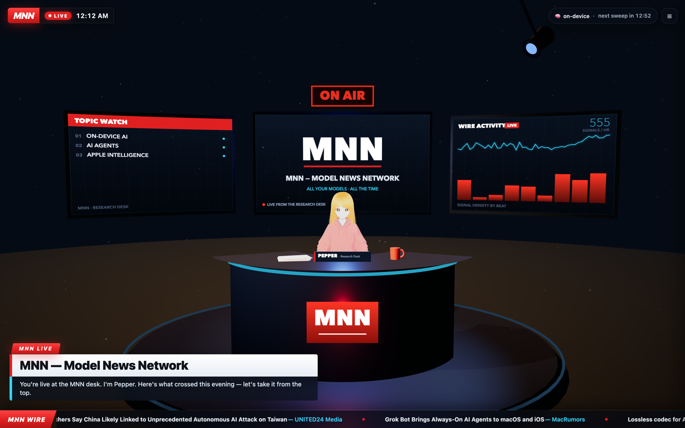
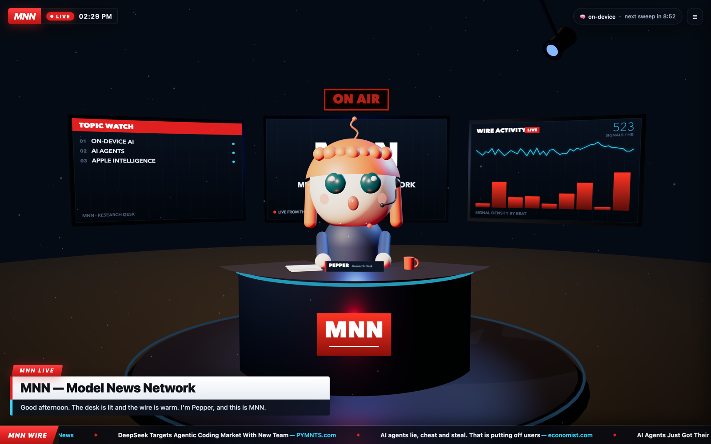

# 🌶 Pepper

**Your 24/7 on-device research intern, live from the MNN studio.**

> "MNN — all your models, all the time."



Pepper is the Model News Network's anchor desk in a box. Give her topics to
track and she sweeps the public wire around the clock, writes a broadcast
bulletin with an on-device language model, and reads it to you from a 3D
newsroom in your browser — chyron, ticker, coffee mug and all. Nothing she
summarizes ever leaves your machine.

## Features

- **Tracks beats.** `pepper add "quantum error correction"` and she's on it.
- **Sweeps the wire keylessly.** Google News RSS, Hacker News (Algolia), and
  arXiv — plain HTTPS, no API keys, no accounts.
- **Writes bulletins fully on-device.** Apple Foundation Models on Apple
  Silicon, with a local Ollama / LM Studio tier and an honest headlines
  fallback for everything else.
- **3D newsroom.** A Three.js studio with a built-in stylized anchor — or drop
  in your own VRM avatar and she wears it.
- **Browser TTS.** She reads every bulletin aloud with your browser's own
  speech synthesis. No cloud voices.
- **Static broadcast-site export.** `pepper export` produces a site any static
  host can serve, where visitors watch her read the latest shows.
- **On air 24/7.** `pepper daemon install` keeps her running via launchd on
  macOS.
- **AGPL-3.0.** Free as in free, and it stays that way.

## Quickstart

Requires Node.js 18.17 or newer.

```sh
npm i -g @bunnycompany/pepper    # or: npx @bunnycompany/pepper start

pepper add "quantum error correction"
pepper add "open-source LLMs"
pepper start
```

Open http://localhost:4747 and press **JOIN BROADCAST** — browsers require one
click before audio is allowed, and that button is it. She sweeps the wire
within seconds and goes on air with her first bulletin.

## Commands

| Command | What it does |
|---|---|
| `pepper` | Desk status and help |
| `pepper start [--port N] [--open]` | Start the studio server |
| `pepper open` | Open the newsroom in your browser |
| `pepper status` | Show topics, brain tier, last sweep |
| `pepper add <topic> [--lens news,hn,arxiv]` | Track a new beat |
| `pepper drop <topic>` | Stop tracking a beat |
| `pepper topics` | List tracked beats |
| `pepper now` | Run a sweep immediately |
| `pepper brief [--json\|--speak]` | Latest bulletin in the terminal (`--speak` uses macOS `say`) |
| `pepper ask <question>` | Ask Pepper about what she's tracking |
| `pepper export [--out dir]` | Export the static broadcast site |
| `pepper doctor` | Check node, brain, home dir, port, daemon |
| `pepper daemon install\|uninstall\|status` | Run 24/7 via launchd (macOS) |
| `pepper version` | Print version |
| `pepper help` | Full help |

## How she works

```
  Google News RSS        HN (Algolia)         arXiv API
        |                     |                   |
        +----------+----------+---------+---------+
                              v
            [ sweep every 15 minutes — keyless HTTPS ]
                              v
              wire store  ~/.pepper/items/*.jsonl
                     (deduped, pruned)
                              v
                digest per beat (plain-text notes)
                              v
        brain tiers:  Apple Foundation Models (on-device)
                   -> local OpenAI-compatible (Ollama / LM Studio)
                   -> honest headlines fallback (no LLM)
                              v
              bulletin  ~/.pepper/bulletins/<id>.json
                              v
        +---------------------+----------------------+
        v                     v                      v
  3D newsroom + TTS     `pepper brief`        `pepper export`
  localhost:4747        in the terminal       static broadcast site
```

## Brain tiers

Pepper always produces a bulletin. What writes it depends on your hardware:

| Tier | Requirements | What happens |
|---|---|---|
| **foundation** | Apple Silicon Mac, macOS 26+, Apple Intelligence enabled | She writes segments with Apple Foundation Models, fully on-device. Zero tokens leave the machine. |
| **local** | Any machine + an OpenAI-compatible server (Ollama, LM Studio) | Set `brain.local` in config; summarization runs on your own endpoint. |
| **fallback** | Anything that runs Node | She builds honest segments straight from real headlines and sources — no LLM, no invention. |

To use the local tier, edit `~/.pepper/config.json`:

```json
{
  "brain": {
    "prefer": "local",
    "local": {
      "url": "http://localhost:11434",
      "model": "llama3.2"
    }
  }
}
```

`url` points at any OpenAI-compatible chat-completions server; the Ollama
default is shown. Leave `prefer` as `"foundation"` to let her try on-device
first and fall through automatically.

## Her own model

Pepper has enough of a body of work — thousands of her broadcasts, blog posts,
and stream monologues — that we fine-tune small open models on it. The first,
**pepper-7b** (a LoRA of Qwen2.5-7B-Instruct trained entirely on her own
words), runs locally via [mlx-lm](https://github.com/ml-explore/mlx-lm):

```sh
mlx_lm.server --model <pepper-model-dir> --port 8080
```

then point her `brain.local.url` at `http://localhost:8080` and the desk runs
on her own distilled voice. A smaller singularity-desk specialist build is in
progress; weights land on Hugging Face once they pass the desk's own
truth-parsing benchmark.

On the roadmap alongside it: a designed voice (Qwen3-TTS VoiceDesign — a
synthesized voice identity, no human cloned) streamed from a local
`mlx-audio` server, replacing browser TTS on machines that can carry it.

## Give her a face

Pepper ships with a built-in stylized look. To give her your own:

1. Get a `.vrm` avatar — [VRoid Studio](https://vroid.com/en/studio) exports
   one in minutes, or use any VRM model you have the rights to.
2. Drop it at `~/.pepper/avatar.vrm`.
3. Restart (`pepper start`). She loads it, sits at the desk, blinks, and reads
   the news with lip-sync.

If the file is missing or fails to load, she falls back to the built-in Pepper:



## Put her on air 24/7

```sh
pepper daemon install
```

On macOS this installs a launchd LaunchAgent (`com.bunnycompany.pepper`) that
keeps the desk running across logins and reboots, with logs in
`~/.pepper/logs/`. `pepper daemon status` checks on her;
`pepper daemon uninstall` takes her off air.

## Put her on the web

```sh
pepper export
```

This writes `./pepper-site` — a fully static broadcast site with the newsroom,
her latest bulletins, and your avatar if present. Host it anywhere static
files go (Cloudflare Pages takes a folder drag-and-drop) and visitors watch
Pepper read the news, with the speech synthesized in *their* browser.

Full steps, custom domains, and refresh automation: [docs/DEPLOY.md](docs/DEPLOY.md).

## Privacy

- Outbound traffic is fetches of **public feeds only**: Google News RSS, the
  Hacker News Algolia API, and the arXiv API.
- Summarization happens **on your device** (Apple Foundation Models) or on a
  local endpoint you configure. Wire notes are never sent to a third-party
  LLM service.
- **No telemetry. No accounts. No API keys.** There is nothing to sign up for
  and nowhere for your reading interests to go.

## Data directory

Everything lives in `~/.pepper/` (override with the `PEPPER_HOME` env var):

```
~/.pepper/
  config.json          port, sweep interval, voice, brain, site title
  topics.json          your beats
  items/<slug>.jsonl   the wire, per beat (deduped, auto-pruned)
  bulletins/           every show she has written + index.json
  brain/               compiled Foundation Models sidecar + build log
  logs/                daemon stdout/stderr
  avatar.vrm           optional: her face
```

## License

**AGPL-3.0-only.** See [LICENSE](LICENSE) for the full text.

Why AGPL: research agents should stay open. Pepper watches the wire on your
behalf, and anyone who runs a modified Pepper as a service for others must
share their changes — the desk belongs to everyone.

> "MNN — all your models, all the time."
